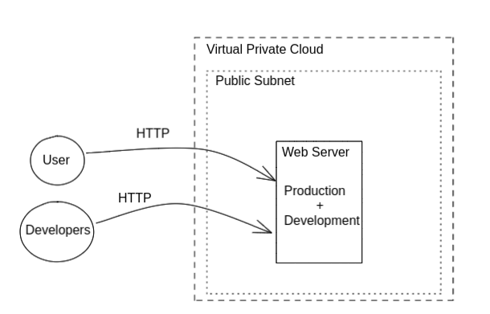
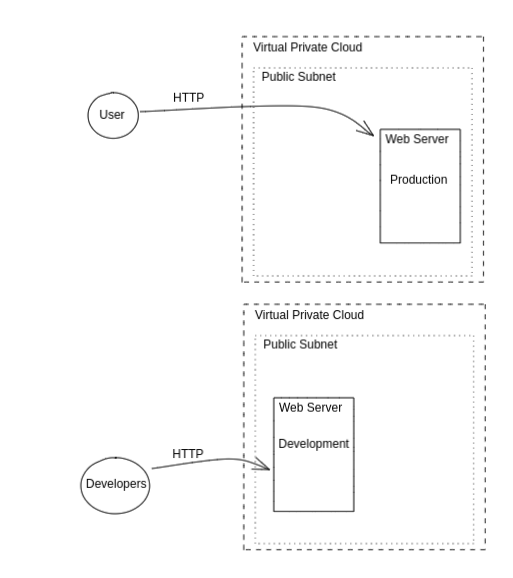
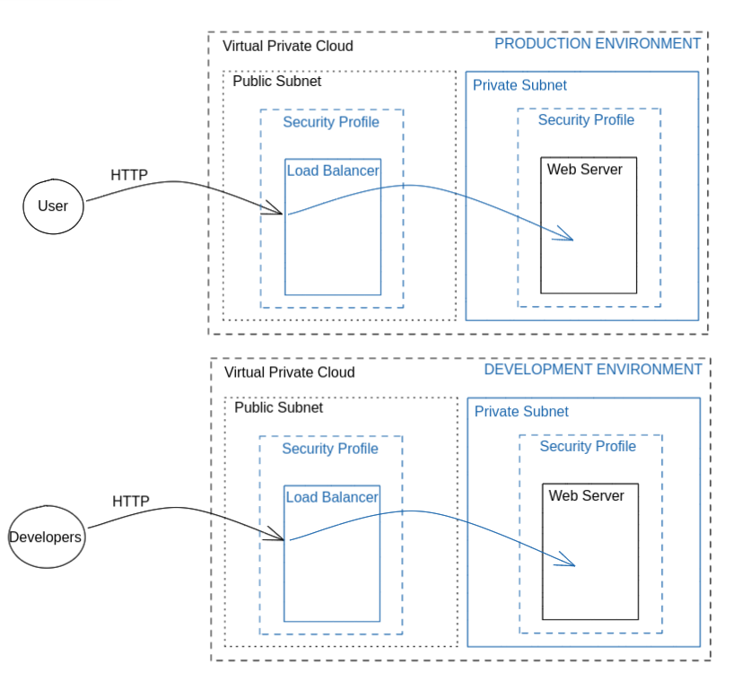

# Exercise ~ Securing an infrastructure with Terraform

In this exercise, you will learn to use terraform to create an AWS environment,
and secure it.

# Install the tools you will need

For this exercise, you will need `terraform` and `curl`.
You can download `terraform` [on the Hashicorp page](https://www.terraform.io/downloads.html).
In the following, the alias `tf` is been used for `terraform`.

TODO : Install and Set AWS with the Access key in `padok_supelec` profile

# Explore the Terraform code

You can explore `iac/` folder to understand the different parts of the code



# Bootstrap the environment

To create the insecure infrastructure, follow these steps:

```bash
cd iac/

# initialize Terraform
tf init

# Create a workspace named `prd`
tf workspace new prd
tf workspace select prd

# View current workspace
tf workspace show

# View the planned actions
tf plan -var-file $(tf workspace show).tfvars

# check for planned actions, and if everything seems ok, say 'yes' to apply them
tf apply -var-file $(tf workspace show).tfvars
```

Wait for the infrastructure to pop. You will get an output like:

```
private_key_pem = <sensitive>
production_webserver = "http://35.180.124.183"
ssh_production = "ssh -o IdentitiesOnly=yes -i ~/.ssh/padok_supelec.id_rsa ubuntu@35.180.124.183"
ssh_stagin = "ssh -o IdentitiesOnly=yes -i ~/.ssh/padok_supelec.id_rsa ubuntu@35.180.124.183"
staging_webserver = "http://15.237.26.206"
unique_id = "MLrHl77c"
```

Check that everything is good:

```
tf output private_key_pem

# Copy paste the key into a file
vim ~/.ssh/padok_supelec.id_rsa
chmod 400 ~/.ssh/padok_supelec.id_rsa

# Check SSH connections
ssh -o IdentitiesOnly=yes -i ~/.ssh/padok_supelec.id_rsa ubuntu@35.180.124.183
ssh -o IdentitiesOnly=yes -i ~/.ssh/padok_supelec.id_rsa ubuntu@35.180.124.183

# Check Web server
curl http://15.237.26.206
```


# Let's secure it !

Ready? Set. Go!

### Step 1 : Split the environments

Create a second Terraform workspace to be able to have two identical environments for staging and production:

```
tf workspace new dev
copy prd.tfvars dev.tfvars
```

The `tfvars` files will be used to defined environment specific variable values.


We want only one webserver in each environment:

1. Modify the dev.tfvars to change the `environment` variable from `prd` to `dev`. It will create resource with `dev` in their name for development environment.

2. Modify `main.tf` to have only one resource to describe both environments (instead of the two existing resources `staging_webserver` and `production_webserver`).

<details>
  <summary>Hint 1</summary>

  You can remove `staging_webserver` and rename `production_webserver` into `webserver`.
  Then you need to modify the resource variable using an hard value that is specific to production instance.
</details>

<details>
  <summary>Hint 2</summary>

  You can modify the resource variable `user_data` to use a variable instead of the hard value `production`.
  Check accessible variables in `variables.tf`.
</details>

<details>
  <summary>Hint 3</summary>

  You can use the variable `environment`.
</details>

<details>
  <summary>Hint 4</summary>

  You can replace `"production"` by `"${var.environment}"`
</details>

3. Modify output.tf accordingly

<details>
  <summary>Hint 1</summary>
  
  Remove or modify outputs that are specific to one environment.
</details>

<details>
  <summary>Hint 2</summary>
  
  Read the tf error when doing `tf plan -var-file $(tf workspace show).tfvars` until there is none!
</details>

<details>
  <summary>Hint 3</summary>
  
  You can remove `"staging_webserver"` output
  You can change `"production_webserver"` output to `"webserver"`
  You can remove `"ssh_staging"` output
  You can change `"ssh_production"` output to `"ssh"`
  etc...
</details>

We will apply these changes in the production environment. It should delete the development webserver.

```
# Should output "prd"
tf workspace show

# Check if Terraform code is valid
tf plan -var-file $(tf workspace show).tfvars

# It should output:
Plan: 1 to add, 0 to change, 2 to destroy.

# Apply changes
tf apply -var-file $(tf workspace show).tfvars

```

Now we will create the developement environment
```
tf workspace select dev

tf apply -var-file ${tf workspace show}.tfvars
```

<details>
  <summary>Solution Step 1</summary>

You can find solution here:
  * [solution/step_1/main.tf](./solution/step_2/main.tf)
  * [solution/step_1/output.tf](./solution/step_2/output.tf)
  * [solution/step_1/dev.tfvars](./solution/step_2/dev.tfvars)
</details>


/!\ You will need two different SSH keys for production and development environment now.

OK ! Now we have separated network for environment. It is already much more secure !



### Step 2 : Add Load Balancing

We would like the webserver for development and production to be in a private subnet, with a frontal load balancer. It would avoid any port except from 80 to be publically accessible on the webserver. It also means that it won't be possible anymore to SSH into the machines (for now). Finally, it is a good practice to use a load balancer. It would allow us for exemple to have autoscaling in the future, or add AWS WAF to protect the website against vulnerabilities.
* The dev environment to be accessible only from CentraleSupelec IP adress


1. Modify the right variable of resource `webserver` in `main.tf` to use a private subnet.

<details>
  <summary>Hint</summary>
  
  Change the value of `subnet_id` variable.
</details>

<details>
  <summary>Solution</summary>
  
  Change `module.vpc.public_subnets[0]` by `module.vpc.private_subnets[0]`.
</details>

2. Modify the right variable of resource `webserver` in `main.tf` to use the private security group.

<details>
  <summary>Hint</summary>
  
  Change the value of `vpc_security_group_ids` variable.
</details>

3. Add a Load balancer in `main.tf` to receive HTTP requests
    * Documentation : https://registry.terraform.io/providers/hashicorp/aws/latest/docs/resources/lb
    * Variables :
      * name: `"${random_string.unique_id.id}-${var.environment}-webserver-lb"`
      * security_groups: Public security group
      * subnets: Public subnet
      * enable_deletion_protection: `false`

<details>
  <summary>Hint</summary>

  Missing variables are:
  * security_groups : `[aws_security_group.allow_pub.id]`
  * subnets: `[module.vpc.public_subnets[0]]`
  * internal: `false`
  * load_balancer_type: `"application"`
</details>


<details>
  <summary>Solution</summary>

Add this to `main.tf` : 

```
resource "aws_lb" "webserver_lb" {
  name               = "${random_string.unique_id.id}-${var.environment}-webserver-lb"
  internal           = false
  load_balancer_type = "application"
  security_groups    = [aws_security_group.allow_pub.id]
  subnets            = module.vpc.public_subnets

  enable_deletion_protection = false
}
```
</details>

4. To configure the load balancer, you will have to add three more resources:
   
* `aws_lb_listener` : Listeners are assigned a specific port to keep an ear out for incoming traffic
  https://registry.terraform.io/providers/hashicorp/aws/latest/docs/resources/lb_listener
* `aws_lb_target_group` : The listener forward traffic to target groups
  https://registry.terraform.io/providers/hashicorp/aws/latest/docs/resources/lb_target_group
* `aws_lb_target_group_attachment` : The instance that the target group will point to.
  https://registry.terraform.io/providers/hashicorp/aws/latest/docs/resources/lb_target_group_attachment

<details>
  <summary>Hint 1</summary>

Variables for `aws_lb_listener` :
  * load_balancer_arn: `"${aws_lb.webserver_lb.arn}"`
  * port: `80`
  * protocol: `HTTP`
  * default_action.type: `"forward"`
  * default_action.target_group_arn: `"${aws_lb_target_group.webserver_lb_target.arn}"`
</details>

<details>
  <summary>Hint 2</summary>

Variables `aws_lb_target_group`:
  * name: `"${random_string.unique_id.id}-${var.environment}-webserver-lb-tg"`
  * port: lb_listener port
  * protocol: lb_listener protocol
  * vpc_id: `module.vpc.vpc_id`
</details>

<details>
  <summary>Hint 3</summary>

Variables `aws_lb_target_group_attachment`:
  * target_group_arn: `"${aws_lb_target_group.webserver_lb_tg.arn}"`
  * target_id: `"${aws_instance.webserver.id}" `
  * port: lb_listener port
</details>

<details>
  <summary>Solution</summary>

Add this to `main.tf` : 
    
  ```
    resource "aws_lb_listener" "webserver_lb_listener" {  
    load_balancer_arn = "${aws_lb.webserver_lb.arn}"  
    port              = "80"  
    protocol          = "HTTP"
    
    default_action {    
      target_group_arn = "${aws_lb_target_group.webserver_lb_target.arn}"
      type             = "forward"  
    }
  }

  resource "aws_lb_target_group" "webserver_lb_target" {
    name     = "${random_string.unique_id.id}-${var.environment}-webserver-lb-tg"
    port     = 80
    protocol = "HTTP"
    vpc_id   = module.vpc.vpc_id
  }

  resource "aws_lb_target_group_attachment" "webserver_lb_tg_attachment" {
    target_group_arn = "${aws_lb_target_group.webserver_lb_tg.arn}"
    target_id        = "${aws_instance.webserver.id}"  
    port             = 80
  }
  ```
</details>

<details>
  <summary>Solution Step 2</summary>

You can find solution here:
  * [solution/step_2/main.tf](./solution/step_2/main.tf)
  * [solution/step_2/output.tf](./solution/step_2/output.tf)
</details>


1. Change `output.fr` to :
   * Comment the `ssh` output and `private_key_pem`. (not useful for now)
   * Modify the `webserver` output to get the Load balancer DNS name instead

<details>
  <summary>Hint</summary>

  value: `"http://${aws_lb.webserver_lb.dns_name}"`
</details>


Apply changes ! 

If everything goes well, you now have a load balancer created.

Look for the one with your random prefix in its name.

```
curl http://RtIr69Zk-dev-webserver-lb-1866337979.eu-west-3.elb.amazonaws.com
<h2>This is the dev environment <h2>
```

## Step 3 : Network filtering 

It is time to restrict access to the public subnet for `dev` environment

1. Add a variable `ip_whitelist` of type `list` in `variables.tf` and modify `prd.tfvars` and `dev.tfvars` accordingly

<details>
  <summary>Solution</summary>

* `prd.tfvars` : `ip_whitelist = []`
* `dev.tfvars` : `ip_whitelist = ['<your_ip>/32']`
</details>

2. Modify `allow_pub` resource in `network.tf` to only allow your public IP address **only for dev environment**

<details>
  <summary>Solution</summary>

You can find solution here:
  [solution/step_3/network.tf](./solution/step_3/network.tf)
</details>

# Finally : Apply to production environment

The beauty of terraform is that you can apply the changes to `prd` environment in a jiffy :

```
tf workspace select prd
tf apply -var-file $(tf workspace show).tfvars
```



# Bonus

We could improve the infrastructure much more, for example:

* Have ASG (Auto Scaling Group) instead of only one instance to ensure high availability and scalability.

* Create and admin bastion to access our server in SSH : Developers could SSH to an EC2 instance in a public subnet, and from it get access to the webserver in SSH with SSH tunnelling.
